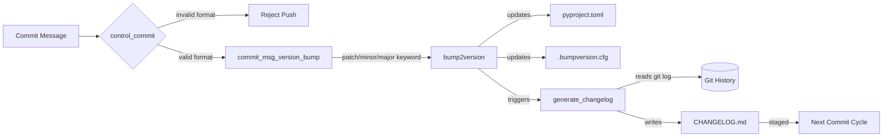
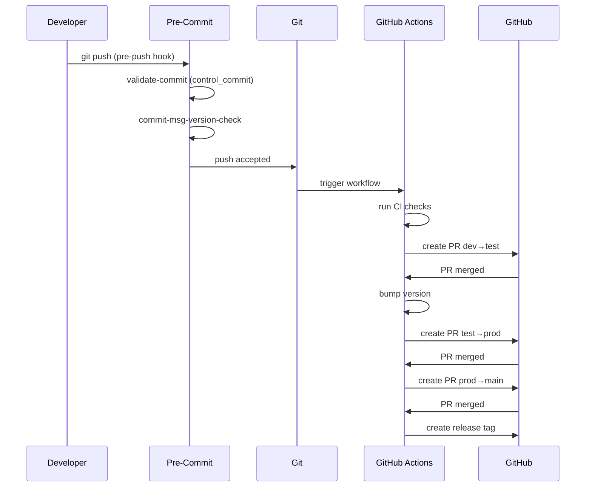

# Architecture

## Package Structure

```text
JuanVilla424/
├── .bumpversion.cfg          # Version bump configuration
├── .pre-commit-config.yaml   # Pre-commit hook definitions
├── .pylintrc                 # Pylint linting configuration
├── .gitmodules               # Git submodule references
├── pyproject.toml            # Project metadata and tool configuration
├── requirements.txt          # Runtime + tooling dependencies
├── requirements.dev.txt      # Development-only dependencies
├── CHANGELOG.md              # Auto-generated change history
├── CONTRIBUTING.md           # Contribution guidelines
├── CODE_OF_CONDUCT.md        # Community standards
├── INSTALL.md                # Installation instructions
├── SECURITY.md               # Security policy and disclosure
├── VERSIONING.md             # Versioning strategy documentation
├── README.md                 # Project overview and documentation
├── ARCHITECT.md              # This file - architecture reference
├── CONTEXT.md                # Project context and entry points
├── LICENSE                   # GNU GPLv3 license
├── scripts/                  # CI/CD scripts (git submodule)
│   ├── bump_year/            # Copyright year updater
│   ├── commit_msg_version_bump/  # Version bump from commit message
│   ├── control_commit/       # Commit message validator
│   ├── crypto_controller/    # Cryptographic config initializer
│   ├── format_yaml/          # YAML formatter
│   ├── format_yml/           # YML formatter
│   ├── generate_changelog/   # Changelog generator
│   ├── init_security_config/ # Security baseline initializer
│   ├── init_template/        # Repository bootstrapper
│   ├── validate_docker_compose/  # Docker Compose validator
│   └── tests/                # Script test suite
├── langding/                 # Langding submodule (AI landing pages)
├── static/                   # Static assets
├── node_modules/             # Node.js dependencies (Prettier)
└── venv/                     # Python virtual environment (not committed)
```

## Module Responsibilities

| Module                            | Responsibility                                                                   |
| --------------------------------- | -------------------------------------------------------------------------------- |
| `scripts/bump_year`               | Scans tracked files for outdated copyright years and updates them at commit time |
| `scripts/commit_msg_version_bump` | Parses commit messages for versioning keywords and triggers bump2version         |
| `scripts/control_commit`          | Enforces conventional commit format and rejects non-conforming messages          |
| `scripts/generate_changelog`      | Reads git log and generates structured CHANGELOG.md entries                      |
| `scripts/format_yaml`             | Applies consistent YAML formatting rules to `.yaml` files                        |
| `scripts/validate_docker_compose` | Parses and validates docker-compose files for structural correctness             |
| `scripts/crypto_controller`       | Initializes cryptographic keys and secrets configuration                         |
| `scripts/init_security_config`    | Bootstraps security baseline files (SECURITY.md, policies) in new repositories   |
| `scripts/init_template`           | Copies template structure into new repositories                                  |
| `.pre-commit-config.yaml`         | Orchestrates all hooks at commit and pre-push stages                             |
| `pyproject.toml`                  | Defines project metadata, tool configs (black, isort, pylint, pytest)            |
| `.bumpversion.cfg`                | Controls which files are updated when version is bumped                          |

## Design Decisions

1. **Submodule-based scripts**: CI/CD scripts are maintained in a separate `scripts` repository and referenced as a git submodule. This allows all repositories using this template to receive script updates via `git submodule update --remote` without duplicating code.

2. **Branch-based release flow**: The four-branch model (dev → test → prod → main) enforces progressive validation before code reaches production. GitHub Actions workflows automate pull requests and version bumps between branches.

3. **Commit-driven versioning**: Version bumps are triggered by commit message keywords (`[major candidate]`, `[minor candidate]`, `[patch candidate]`), eliminating manual version management and ensuring changelogs stay in sync with releases.

4. **Pre-commit as quality gate**: All formatting, linting, and validation runs locally via pre-commit hooks before code reaches CI, reducing feedback loop time and preventing trivially broken commits from entering the pipeline.

## Mermaid Diagrams

### Architecture Overview

```mermaid
graph TB
    DEV[Developer Workstation]
    PC[Pre-Commit Hooks]
    GIT[Git Repository]
    GA[GitHub Actions]

    subgraph Branches
        BDEV[dev branch]
        BTEST[test branch]
        BPROD[prod branch]
        BMAIN[main branch]
    end

    subgraph Scripts Submodule
        BY[bump_year]
        CC[control_commit]
        GC[generate_changelog]
        CV[commit_msg_version_bump]
    end

    DEV -->|git commit| PC
    PC -->|trailing-whitespace, black, pylint, yaml-format| PC
    PC -->|bump-year, generate-changelog| Scripts Submodule
    PC -->|validated commit| GIT
    GIT --> BDEV
    BDEV -->|PR + version bump| BTEST
    BTEST -->|PR + version bump| BPROD
    BPROD -->|PR + version bump| BMAIN
    BMAIN -->|release tag| GA
```

### Data Flow



### Sequence: Commit to Release


