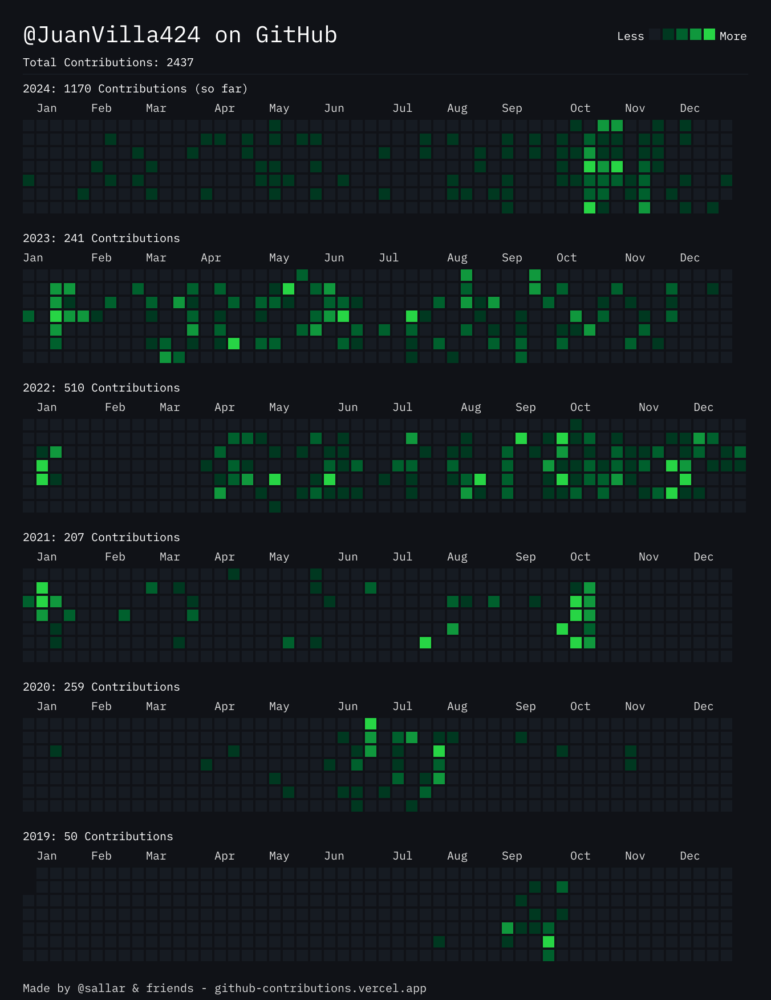

# 🚀 About Me

na0nh

## 🛠️ Skills & Technologies

### Servers

### Databases

### Tools & Platforms

### Programming Languages

### Frameworks & Libraries

### CICD

## 📈 GitHub Stats

## 🏆 GitHub Trophies

## 🔗 Connect with Me

## 📚 Featured Projects

### [Github CICD Template](https://github.com/JuanVilla424/github-cicd-template)

Github CICD Template Repository

### [Scripts](https://github.com/JuanVilla424/scripts)

CICD Core Scripts Repository

## 📊 Contributions

## 📫 Contact

For any inquiries or support, please open an issue or contact [r6ty5r296it6tl4eg5m.constant214@passinbox.com](mailto:r6ty5r296it6tl4eg5m.constant214@passinbox.com).

---

## 📜 License

2024 - Each repo contains its owns license. see **LICENSE**
